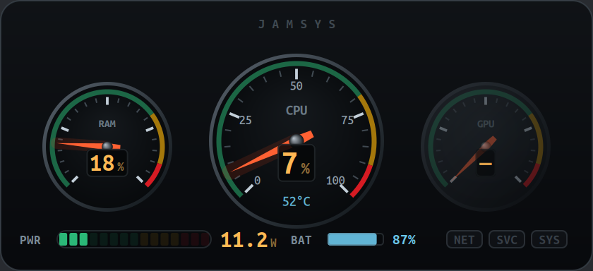
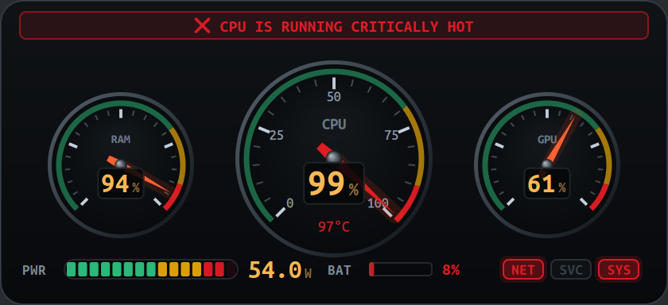

# JamSys

**A lightweight local system-health monitor for Linux laptops.**

One question, answered in one second:

> Is my machine behaving normally right now, and has anything unusual happened?

```
┌──────────────────────────────────────────────────────────────┐
│  ✓  Everything is normal                                     │
│     All 11 monitored subsystems are behaving normally.       │
└──────────────────────────────────────────────────────────────┘
```

or

> **NOTICE — Unusually high power draw while idle**
> Battery discharge is **28.4 W**.
> Expected: your learned idle range on battery is **8.7 – 13.5 W** (median 10.9 W, from 3 412 samples).
> Ongoing for **11 minutes**.
>  · CPU usage: 2%
>  · Above baseline by: 17.5 W
> Likely cause: the NVIDIA GPU is active and drawing 6.2 W although its utilisation is 0%
> Suggested checks:
>  → Compare the Power page history against the shaded normal band
>  → Check the GPU page for a discrete GPU that is awake

Never "anomaly detected".

---

## Three surfaces

**The glance** — a desktop instrument cluster in a corner of your screen. Swept
tachometer dials, a redline, machined bezels, a segmented power strip and dashboard
telltales that stay dark until they have something to say.



When something is wrong it says so, in the header and on the instruments:



It does not poll. The daemon pushes an update only when a displayed value has changed
enough for a human to notice, so nothing repaints for sensor noise and nothing animates.

Two ways to run it:

```bash
jamsys-cluster                       # its own window — works immediately, any desktop
gnome-extensions enable jamsys@jamsys.org   # in the Shell — needs a logout first
```

The Shell extension is the better one: it can pin itself to a corner and stay above
other windows, which Wayland does not allow an ordinary window to do. But GNOME will
not load a newly installed extension until the session restarts, so the window is what
you get today.

Prefer a line of text in the top panel instead? That is still there:

```
CPU 7% · 52° | RAM 18% | GPU — | 11.2W | NET ✓
⚠ POWER 29.8W                                   ← abnormal replaces the readings
```

**The investigation** — a GTK4 window with a page per subsystem, opened by clicking the
cluster.

**The controls** — keyboard backlight and RGB, the one thing JamSys can change.

## What it watches

CPU (usage, per-core, load, frequency, temperature, throttling, PSI) · memory (usage,
cache, swap, pressure, OOM, per-process leak detection) · Intel and NVIDIA GPUs
(utilisation, VRAM, temperature, power, P-state, runtime power management, Xid errors)
· battery and power (charge, watts, voltage, health, cycles, runtime, AC state,
suspend drain) · thermals and fans · storage (filesystems, inodes, throughput, latency,
NVMe temperature and SMART, ext4 error counters) · network (per-interface state,
throughput, errors, Wi-Fi signal, default route, gateway/DNS/internet reachability,
event timeline) · Bluetooth · audio (PipeWire, WirePlumber, devices) · USB and cameras ·
systemd units · the kernel journal · suspend and resume · a hardware inventory with a
change log.

## What it is not

No Docker. No Prometheus, Grafana or Elasticsearch. No Electron. No cloud, no account,
no telemetry, no update check. **No packet capture** — network monitoring reads counters,
never payloads. Nothing leaves the machine. Everything lives in
`~/.local/share/jamsys/`; delete that directory and all history is gone.

## How it is put together

```
jamsysd  (Rust, systemd --user service)   →  keeps running with everything closed
   ├── one thread, one epoll loop, one timer
   ├── 12 isolated collectors on four sampling tiers + event-driven sources
   ├── full resolution in memory; 10-second means on disk; rollups beyond that
   ├── Unix socket, newline-delimited JSON  →  the full protocol, for the window
   └── D-Bus org.jamsys.Monitor           →  eight numbers, pushed on change

GNOME Shell extension  →  the glance. No monitoring logic; ~300 lines of rendering.
jamsys (GTK4 + Adw)  →  the investigation. A thin client; start and stop freely.
jamsys-helper (root, optional, oneshot)  →  reads 2 metrics. No input channel.
jamsys-kbd    (root, optional, Polkit)   →  writes 3 LED attributes. 208 lines.
```

Full reasoning in [`docs/architecture.md`](docs/architecture.md). The interface talks to
the daemon over the protocol in [`docs/ipc-protocol.md`](docs/ipc-protocol.md), so a
different front-end — Tauri, web, TUI — can be written against the same daemon.
`jamsys --json <op>` is a working reference client.

## Measured cost on the development machine

| | |
|---|---|
| Daemon CPU, idle regime | **0.089 % of one core** (0.004 % of a 24-thread CPU) |
| Daemon CPU, default tiers | **0.27 – 0.30 % of one core** |
| Daemon memory | **28 MB RSS / 23.6 MB PSS**, 2 threads |
| Wakeups | **0.99 / s** idle, 2.63 / s default |
| **Discrete GPU wake time caused by JamSys** | **0 ms in 90 s** |
| Database growth | ~19 MB/day; ~75 MB steady state at default retention |

Method and full numbers: [`docs/performance.md`](docs/performance.md).

That last row is the one that took the most design effort. Reading NVML wakes a
runtime-suspended discrete GPU and holds it awake for about nine seconds — measured on
this hardware. A monitor that polls it becomes the battery drain it claims to detect, so
JamSys reads the runtime power state from sysfs first and touches NVML only when the
GPU is already awake, and defers `nvmlInit()` until then too.

---

## Install

### From the .deb

```bash
./packaging/build-deb.sh
sudo apt install ./build/jamsys_1.0.0_amd64.deb
systemctl --user daemon-reload
systemctl --user enable --now jamsysd
```

Then launch **JamSys** from your applications, or run `jamsys`.

### From source, for one user, without root

```bash
./scripts/install-user.sh
```

Installs into `~/.local`, writes a user unit, starts it. No root anywhere.

### The corner cluster

```bash
# Installed by the .deb. GNOME Shell will not load a *new* extension on Wayland
# without a session restart, so log out and back in first, then:
gnome-extensions enable jamsys@jamsys.org
gnome-extensions prefs  jamsys@jamsys.org   # corner, size, opacity, style
```

Any of the four corners, plus top-centre, with an adjustable edge margin, size
(0.55×–1.8×) and housing opacity. The cluster floats above the desktop as a Shell
chrome actor — the same mechanism OSD popups use — rather than an ordinary window
pretending to be chrome. It can overlap a dock and is hidden by fullscreen windows;
that limitation is documented rather than hacked around.

A new extension is not loaded until the session restarts, so until you next log out,
run the same cluster as a window:

```bash
jamsys-cluster
```

Scroll it to resize, drag it anywhere, right-click for size presets, opacity, **Always
on top** and **On all workspaces**. Size and stacking are remembered in
`~/.config/jamsys/cluster.json`.

Always-on-top works by asking the window manager over EWMH, which Mutter honours for
X11 clients, so the launcher runs the window on XWayland. Wayland itself gives an
application no way to raise itself — under `jamsys-cluster --wayland` the two stacking
toggles are greyed out and say so.

### Keyboard lighting

Installed and ready with the .deb — `/usr/libexec/jamsys-kbd` plus a Polkit action.
Open **Hardware** in the window.

If you would rather have no privileged binary at all, install the udev rule instead and
skip the helper:

```bash
sudo install -m0644 /usr/share/doc/jamsys/examples/99-jamsys-keyboard.rules /etc/udev/rules.d/
sudo udevadm control --reload && sudo udevadm trigger -s leds
```

The Hardware page detects which path is available and says which one it is using.

### Optional privileged helper

Adds exactly two metrics: CPU package power (RAPL) and NVMe SMART health.
**Everything else works without it.**

```bash
sudo systemctl enable --now jamsys-helper.timer
```

It is a `oneshot` unit on a 60-second timer that reads two fixed paths, writes one JSON
file and exits. It takes no arguments, no stdin and opens no socket, so there is no
root-privileged parser reachable from unprivileged code. See
[`docs/privilege-model.md`](docs/privilege-model.md).

### Build requirements

```bash
sudo apt install build-essential rustc cargo python3-gi gir1.2-gtk-4.0 gir1.2-adw-1
```

Rust 1.75 or newer. The UI needs no build step.

### Uninstall

```bash
./scripts/uninstall.sh              # source install
sudo apt remove jamsys            # package, keeps history
sudo apt purge  jamsys            # package, also clears /run state
```

Neither removes `~/.local/share/jamsys`; the uninstall script offers to.

---

## First run

1. Hardware is detected and each collector decides what it can actually do here.
2. The **Coverage** page shows exactly what is monitored, what is partial, and what is
   unavailable with the reason.
3. Baseline learning begins. Learned rules stay silent until they have at least 120
   samples in a given context — roughly 20 minutes — and the Coverage page says so.
4. Deterministic safety rules (temperature, disk full, OOM, SMART, Xid) are active
   immediately; they need no history.

Preview what will be monitored before installing anything:

```bash
jamsysd --discover
```

---

## How anomalies are decided

Two layers, both explainable by hand. No machine learning, deliberately.

**Layer 1 — deterministic thresholds.** Physically meaningful limits that hold
regardless of history: package temperature ≥ 95 °C for 60 s, a filesystem ≥ 95 %, an OOM
kill, a SMART critical warning, a fan at 0 rpm while something is at 70 °C, an NVIDIA Xid.
Every threshold is adjustable per rule, and the alert always quotes the value in force.

**Layer 2 — learned baselines.** Robust statistics (median and MAD, not mean and
standard deviation, so one compile does not poison the model) over a bounded reservoir,
**partitioned by operating context**: AC vs battery × idle vs active. Comparing a
battery-idle reading against an AC-active baseline is the classic source of false alerts.

Five guards keep it honest: a warm-up minimum, a floor on MAD so a constant metric cannot
produce an infinite score, a required *absolute* delta as well as a statistical one, a
dwell time, and self-exclusion so an ongoing fault cannot slowly teach the baseline that
it is normal.

Details, thresholds and the full rule table: [`docs/anomaly-engine.md`](docs/anomaly-engine.md).

## Alerts

Four levels — INFO, NOTICE, WARNING, CRITICAL — as desktop notifications sent by the
daemon, so they work with the window closed. Every alert states the measurement, the
expected range, how long it has been true, the contributing evidence, a likely cause
*only when something actually correlates*, and one or two safe read-only things to check.

Each alert offers **Mute**, **Snooze** (1 h / 8 h / 24 h), **Ignore this rule**,
**Ignore this device or service**, and **Change threshold**. Suppressed alerts stay
visible with a muted badge rather than disappearing — hiding them is how people forget
they turned something off.

Deduplication is enforced twice: in memory, and by a partial unique index in SQLite, so a
daemon restart cannot resurrect a duplicate. A token bucket per severity stops a flapping
sensor from producing hundreds of notifications, and the suppressed count is shown.

## Configuration

`~/.config/jamsys/config.toml`, created with commented defaults on first run.
Sampling intervals, retention, baseline tuning, notification severity, reachability
probing, ignored mounts, ignored journal patterns and ignored services all live there.

```bash
systemctl --user reload jamsysd   # apply without restarting
```

Every collector can be disabled individually, from the file or from the Coverage page.

## Command line

```bash
jamsys-cluster            # the instrument cluster in its own window
jamsysd --discover        # hardware and coverage report
jamsysd --check           # validate the config
jamsys  --json snapshot   # current state as JSON
jamsys  --json alerts '{"open_only":true}'
jamsys  --json stats      # the daemon's own resource usage
```

## Documentation

| | |
|---|---|
| [architecture.md](docs/architecture.md) | design, event loop, sampling tiers, failure philosophy |
| [hardware-discovery.md](docs/hardware-discovery.md) | what the target machine actually exposes, and the interface chosen for each subsystem |
| [privilege-model.md](docs/privilege-model.md) | what needs root, why the helper has no IPC, socket access control, privacy |
| [database-schema.md](docs/database-schema.md) | SQLite schema, retention, sizing |
| [anomaly-engine.md](docs/anomaly-engine.md) | both detection layers, the full rule table, alert lifecycle |
| [UI-architecture.md](docs/UI-architecture.md) | information architecture of the interface |
| [ipc-protocol.md](docs/ipc-protocol.md) | the daemon protocol |
| [performance.md](docs/performance.md) | measured cost of the monitoring application itself |
| [troubleshooting.md](docs/troubleshooting.md) | when something is not working |
| [support-matrix.md](docs/support-matrix.md) | honest statement of what is and is not supported |

## Tests

```bash
cd jamsys-daemon && cargo test           # 247 tests
cd jamsys-helper && cargo test           #   5 tests
cd jamsys-kbd    && cargo test           #  10 tests, all the injection attempts
gjs -m gnome-extension/tests/format-test.js      # panel-line rendering
gjs -m gnome-extension/tests/gauges-test.js      # needle mapping and geometry
gjs -m gnome-extension/tests/shell-api-test.js   # GNOME 50 API contract
gjs -m gnome-extension/tests/live-dbus-test.js   # end-to-end against the live daemon
gjs -m gnome-extension/tests/render-cluster.js /tmp   # draw every state to PNG
./scripts/fault-injection.sh list                # controlled fault injection
```

`render-cluster.js` is how the cluster was designed at all: GNOME will not load a new
extension without a session restart, so the drawing code takes a plain Cairo context and
the harness feeds it an image surface instead of a widget. `--live` renders your actual
machine.

Covering the threshold engine, baseline mathematics, alert deduplication and rate
limiting, retention and rollups, every parser, missing sensors, invalid sysfs data,
NVIDIA absent, a machine with no battery, a machine with no Wi-Fi, charge-domain
batteries, suspend/resume detection, and collector isolation under panics.

## Licence

MIT.
